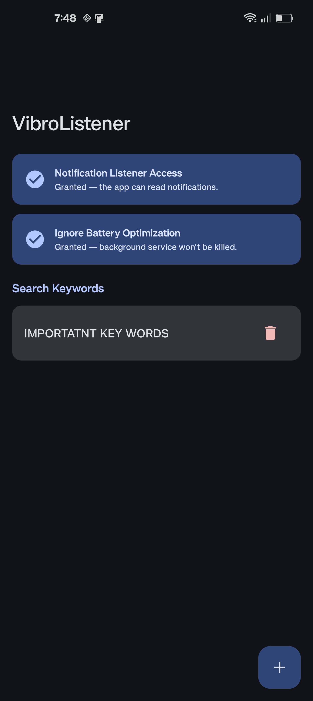
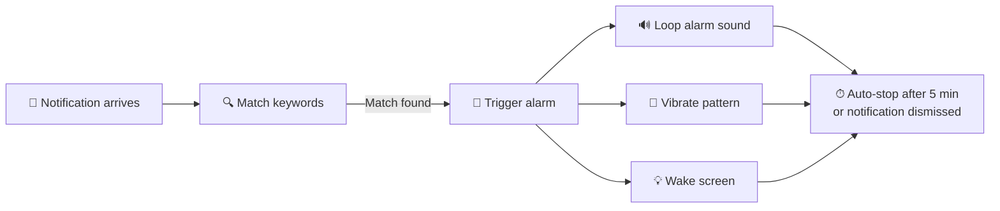

# VibroListener

An Android app that monitors incoming notifications for user-defined keywords and triggers an **unmissable hardware alarm** — sound, vibration, and screen wake — that cuts through **Silent** and **Do Not Disturb** modes.

Never miss a critical notification again.

## 📱 Screenshot

<p align="center">
  
</p>

## ✨ Features

- **Keyword-Based Notification Matching** — Define keywords to watch for across notification title, body, package name, and ticker text (case-insensitive)
- **Persistent Alarm** — Loops the device's default alarm sound using `USAGE_ALARM` to bypass Silent & DND modes
- **Continuous Vibration** — Repeating vibration pattern (2s on / 4s off) with alarm-level priority
- **Screen Wake** — Automatically wakes and lights up the screen when a match is detected
- **Auto-Stop** — Alarm auto-cancels after 5 minutes or when the triggering notification is dismissed
- **Keyword Management** — Add and delete monitored keywords with a clean Material 3 UI, backed by a local Room database
- **Permission Diagnostics** — In-app status cards guide you through enabling Notification Listener access and battery optimization exemptions

## 📱 How It Works



1. **`KeywordNotificationListenerService`** listens for all incoming notifications
2. Each notification's title, body, package name, and ticker are checked against your saved keywords
3. On match → the alarm coordinator fires sound, vibration, and screen wake simultaneously
4. The alarm runs continuously until you dismiss the notification or 5 minutes elapse

## 🛠 Tech Stack

| Layer | Technology |
|---|---|
| Language | Kotlin 2.2 |
| UI | Jetpack Compose + Material 3 |
| Architecture | MVVM + Clean Architecture + UDF |
| DI | Dagger Hilt 2.60 |
| Database | Room 2.8 (with Kotlin Flow) |
| Navigation | Compose Navigation |
| Annotation Processing | KSP |
| Min SDK | 36 (Android 16) |
| Target SDK | 36 (Android 16) |
| Compile SDK | 37 |

## 🏗 Project Structure

```
com.example.vibrolistner/
├── VibroListnerApplication.kt              # Hilt Application entry point
├── MainActivity.kt                         # Single Activity with Compose NavHost
├── navigation/
│   └── VibroNavHost.kt                     # Navigation graph (home, addKeyword)
├── feature/
│   ├── home/
│   │   ├── HomeScreen.kt                   # Permission banners, keyword list, FAB
│   │   └── HomeViewModel.kt               # Keyword list state & deletion
│   └── addkeyword/
│       ├── AddKeywordScreen.kt             # Keyword input form
│       └── AddKeywordViewModel.kt          # Input validation & insertion
├── service/
│   └── KeywordNotificationListenerService.kt  # Core notification listener
├── core/
│   ├── alert/
│   │   ├── AlertCoordinator.kt             # Alert lifecycle, timeouts (5 min)
│   │   └── AlertManager.kt                 # Hardware: MediaPlayer, WakeLock, Vibration
│   ├── vibration/
│   │   └── VibrationManager.kt             # Low-level vibration via VibratorManager
│   ├── domain/
│   │   └── NotificationMatchUseCase.kt     # Keyword matching logic
│   ├── data/
│   │   └── KeywordRepository.kt            # Repository over Room DAO
│   ├── database/
│   │   ├── AppDatabase.kt                  # Room database definition
│   │   ├── KeywordDao.kt                   # DAO (getAllKeywords Flow, insert, delete)
│   │   └── KeywordEntity.kt               # Entity: keywords(id, keyword)
│   └── di/
│       ├── DatabaseModule.kt               # Hilt: AppDatabase & KeywordDao
│       └── VibrationModule.kt              # Hilt: VibrationManager & AlertManager
└── ui/theme/                               # Material 3 theme (colors, typography)
```

## 📋 Permissions

| Permission | Purpose |
|---|---|
| `BIND_NOTIFICATION_LISTENER_SERVICE` | Read incoming notifications |
| `VIBRATE` | Trigger device vibration |
| `WAKE_LOCK` | Wake and keep screen on during alarm |
| `REQUEST_IGNORE_BATTERY_OPTIMIZATIONS` | Prevent OS from killing the background service |

> [!IMPORTANT]
> You must manually enable **Notification Listener Access** in device settings. The app provides a direct link to the relevant settings page.

> [!TIP]
> On OxygenOS / OnePlus devices, also disable battery optimization for this app to prevent aggressive background process killing.

## 🚀 Getting Started

### Prerequisites

- Android Studio (latest stable)
- JDK 11+
- Android device running **API 36+** (Android 16)

### Build & Run

```bash
# Clone the repository
git clone https://github.com/<your-username>/keyword-notification-alarm.git

# Open in Android Studio and sync Gradle

# Run on a connected device
./gradlew installDebug
```

### Setup on Device

1. Install and open the app
2. Enable **Notification Listener Access** when prompted
3. Disable **Battery Optimization** for the app (recommended)
4. Tap **+** to add keywords you want to monitor
5. Done — the service runs in the background and alerts you on matches

## 📦 Key Dependencies

- **Jetpack Compose BOM** `2026.02.01` — UI toolkit with Material 3
- **Dagger Hilt** `2.60.1` — Dependency injection
- **Room** `2.8.4` — Local SQLite persistence with Kotlin Flow
- **Navigation Compose** `2.9.8` — In-app navigation
- **Material Icons Extended** — Rich icon set

## 📄 License

This project is licensed under the [MIT License](LICENSE).
